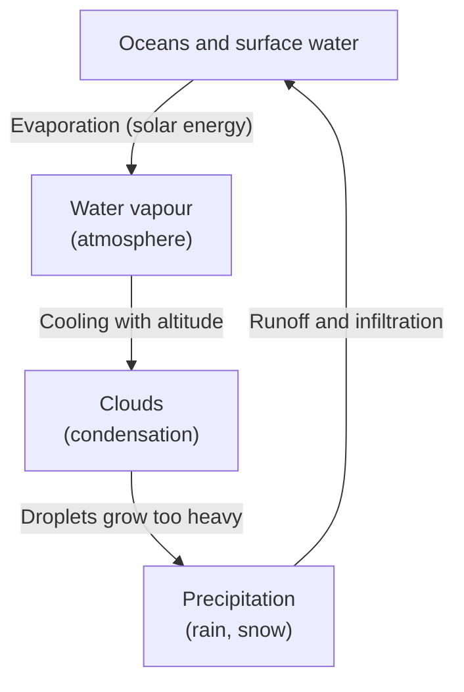

```anim for:water-cycle
---
pace: learner
bind:
  oceans: {node: O}
  vapour: {node: V}
  clouds: {node: C}
  rain: {node: P}
  evaporation: {edge: [O, V]}
  cooling: {edge: [V, C]}
  droplets: {edge: [C, P]}
  runoff: {edge: [P, O]}
---

## Where it starts
show: oceans
focus: oceans

Most of Earth's water sits in the oceans. Everything that follows begins here.

## Evaporation
draw: evaporation
show: vapour
focus: evaporation, vapour

Solar energy turns liquid water into vapour, which rises into the atmosphere.

## Condensation
draw: cooling
show: clouds
focus: cooling, clouds

As it climbs, the vapour cools and condenses around dust particles: clouds form.

## Precipitation
draw: droplets
show: rain
focus: droplets, rain

When the droplets grow too heavy to stay aloft, they fall — as rain or snow.

## The cycle closes
draw: runoff
focus: runoff, oceans
pulse: runoff

Runoff and infiltration carry the water back to where it started. Nothing is
lost: the same water has been travelling this loop for billions of years.
```
