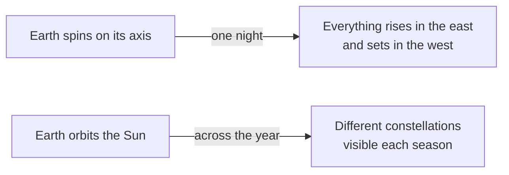

# Planets and Stars, Seen from a Sidewalk

Step outside on a clear night, away from the worst of the streetlights, and the
sky offers a few hundred visible points of light. Most of them are stars. A
handful are planets, and you can usually tell which is which without any
equipment at all.

## Twinkling is atmosphere, not starlight

A star is so far away that it arrives as an effectively *point* source. The
column of air above you is never still: pockets of warmer and cooler air bend
the incoming ray slightly differently from moment to moment. With a single
point of light, every one of those tiny deflections shows up as a flicker.

A planet is enormously closer, so it arrives as a *small disc* rather than a
point. Think of it as many neighbouring rays arriving at once: some are bent
one way, some the other, and the wobbles average out. The light holds steady.

```tikz
\begin{tikzpicture}[scale=1.05]
  \fill[gray!12] (-0.5,1.2) rectangle (6.2,2.3);
  \node[gray!65, font=\small, anchor=west] at (3.5,1.75) {turbulent atmosphere};

  \draw[thick, dashed, gray] (1.3,2.3) -- (4.4,-1.2);
  \node[gray, font=\small, anchor=west] at (4.5,-1.15) {undeflected path};

  \draw[thick] (0,4) -- (1.3,2.3) -- (1.7,1.85) -- (2.0,1.35) -- (2.5,0.1);

  \fill (0,4) circle (0.07) node[above right, font=\small] {star};
  \fill (2.5,0.1) circle (0.06);
  \node[font=\small, anchor=north] at (2.5,0.0) {eye};
\end{tikzpicture}
```

A single ray, deflected differently from instant to instant: that is a twinkle.

> [!tip]
> Low on the horizon, everything twinkles more, you are looking through a much
> longer slant of atmosphere. Judge steadiness on objects reasonably high up.

```summary
Stars twinkle because they are point sources seen through a restless
atmosphere. Planets are discs, large enough that the distortions average out,
so they shine with a steady light.
```

## Two motions, two timescales

The sky changes on two clocks at once, and separating them is most of what
naked-eye astronomy asks of you.



Over a single night, the whole sky wheels overhead: that is the Earth turning
under it. Over weeks and months, the constellations visible after sunset shift
steadily westward: that is the Earth working its way around the Sun, so that
the night side faces a different direction.

```example
Watch Orion across a winter. In early December it clears the eastern horizon
late in the evening. By February the same stars are already high in the south
at the same clock time, about two hours earlier per month.
```

## How much light gets through

Brightness in astronomy is measured in magnitudes, where *lower* means
brighter and each step of 1 is a factor of about 2.5. Naked-eye visibility
runs out somewhere around magnitude 6 in a dark sky, and much sooner than
that under city lighting.

```vega-lite
{
  "$schema": "https://vega.github.io/schema/vega-lite/v5.json",
  "description": "Faintest star visible by sky condition",
  "data": {
    "values": [
      {"sky": "City centre", "magnitude": 3.0},
      {"sky": "Suburb", "magnitude": 4.5},
      {"sky": "Countryside", "magnitude": 5.5},
      {"sky": "Dark site", "magnitude": 6.5}
    ]
  },
  "mark": "bar",
  "encoding": {
    "y": {"field": "sky", "type": "nominal", "sort": null, "title": null},
    "x": {"field": "magnitude", "type": "quantitative", "title": "Faintest magnitude visible"}
  }
}
```

## Planets wander

The word *planet* comes from the Greek for "wanderer". Stars keep their
positions relative to each other for a human lifetime; planets drift against
that fixed background from week to week, because they and the Earth are both
moving around the Sun on their own schedules.

> [!note]
> This is the observation the geocentric model struggled hardest to explain:
> planets occasionally reverse direction for a few weeks before resuming their
> normal drift. That apparent backtracking is called retrograde motion, and it
> falls out naturally once you put the Sun at the centre.
