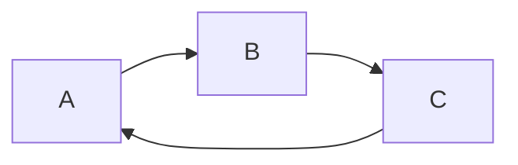
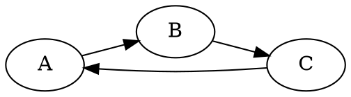

# Introduction to graphs

A **graph** is a collection of nodes (vertices) connected by edges. Graphs
show up everywhere: social networks, road maps, dependency trees, and the
web itself.

> [!note]
> This lesson assumes you already know basic set notation ($V$, $E$).

> [!tip]
> Draw the graph on paper as you read — it makes the definitions click much
> faster than reading alone.

## Formal definition

A graph $G$ is a pair $G = (V, E)$ where $V$ is a set of vertices and
$E \subseteq V \times V$ is a set of edges.

$$
\deg(v) = |\{ e \in E : v \in e \}|
$$

```example
Consider a graph with vertices $V = \{A, B, C\}$ and edges
$E = \{(A, B), (B, C)\}$. Vertex $B$ has degree 2, while $A$ and $C$ each
have degree 1.
```

> [!warning]
> Don't confuse a graph's **order** (number of vertices) with its **size**
> (number of edges) — they're easy to swap by accident.

## Quick check

```quiz
Is the graph above (A–B–C) connected?

- [x] Yes
- [ ] No

> Every vertex can reach every other vertex through some path of edges, so
> the graph is connected.
```

## Visualizing graphs



Graphs are also drawn as node/edge diagrams with Graphviz:



> [!important]
> The Graphviz and Mermaid diagrams above are rendered through
> [kroki.io](https://kroki.io) or the `mermaid` JS library — see the README
> for details and how to point at a different kroki instance. TikZ,
> PlantUML, and D2 fences are also supported through kroki.io, though
> rendering quality/availability depends on that third-party service.

## Blocks this player doesn't render

Some rich block types (interactive D3 visualizations, geographic maps,
chess boards, Vega-Lite specs, …) aren't rendered by this lightweight
player. They degrade gracefully to a labeled source block instead of
silently disappearing:

```d3
// A force-directed layout would normally render here.
const simulation = d3.forceSimulation(nodes)
  .force("link", d3.forceLink(links))
  .force("charge", d3.forceManyBody());
```

```summary
A graph $G = (V, E)$ pairs a vertex set with an edge set. Degree counts a
vertex's incident edges. Graphs are drawn as diagrams (Mermaid, Graphviz, …)
and this player renders both; anything it doesn't understand (like D3
specs) shows up as a labeled, unrendered source block instead of breaking.
```
